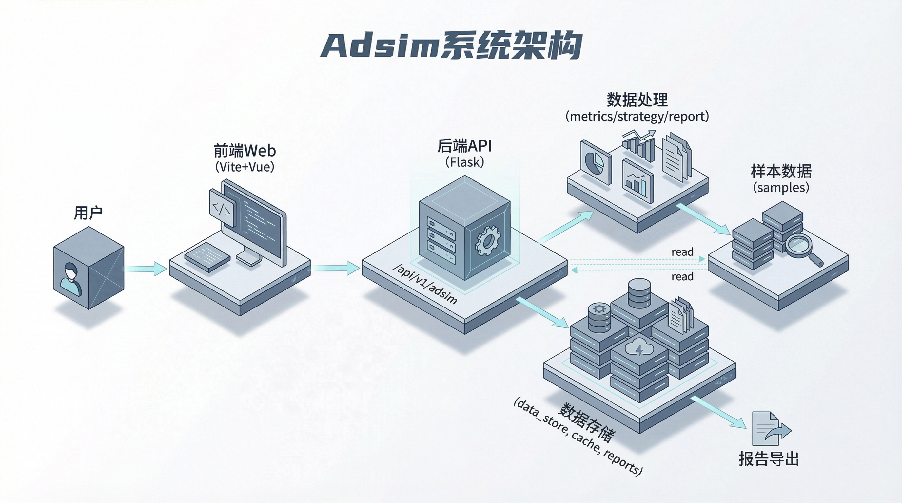

# Adsim


E-commerce ad campaign rehearsal for the competition track:  
compare A/B/C strategies and export a printable report.

## Contents

- [Core Flow](#core-flow)
- [Business Value](#business-value)
- [Innovation](#innovation)
- [Architecture](#architecture)
- [Flow](#flow)
- [UI Screenshots](#ui-screenshots)
- [Data Dictionary](#data-dictionary)
- [Metric Definitions](#metric-definitions)
- [Competitive Comparison](#competitive-comparison)
- [Scoring Alignment](#scoring-alignment)
- [API List and Samples](#api-list-and-samples)
- [Quick Start (Windows)](#quick-start-windows)
- [3-Minute Demo](#3-minute-demo)
- [Project Structure](#project-structure)
- [FAQ](#faq)
- [Credits](#credits)

## Core Flow

Import -> Metrics -> Strategy Compare -> Evidence Cards -> Report Export

## Business Value

- **Fast rehearsal** with minimal input data
- **Explainable decisions** via evidence cards
- **Repeatable demo** for evaluation and teaching

## Innovation

- **Explainable comparison** instead of raw metrics only
- **Interval estimates** to reflect uncertainty
- **Demo-friendly** flow within minutes

## Architecture



> Placeholder image, replace with your actual diagram.

## Flow


> Placeholder image, replace with your actual flow chart.

## UI Screenshots


> Placeholder images, replace with actual screenshots.

## Data Dictionary

### ad_log

| Field | Type | Description |
| --- | --- | --- |
| ad_id | string | Campaign or ad ID |
| impressions | int | Impressions |
| clicks | int | Clicks |
| date | datetime | Date |
| spend | float | Spend (optional) |
| gmv | float | GMV (optional) |
| conversions | int | Conversions (optional) |

### orders

| Field | Type | Description |
| --- | --- | --- |
| order_id | string | Order ID |
| user_id | string | User ID |
| amount | float | Amount (or gmv) |
| order_date | datetime | Order date |
| gross_profit | float | Gross profit (optional) |
| refund_orders | int | Refund order count (optional) |
| is_refund | bool | Refund flag (optional) |

## Metric Definitions

- **CTR** = clicks / impressions  
- **CVR** = orders / clicks (or conversions / clicks)  
- **CPA** = spend / orders  
- **ROI_GP** = gross_profit / spend (fallback to gmv * margin_rate)  
- **Refund Rate** = refund_orders / total_orders

## Competitive Comparison

| Dimension | Adsim | Generic BI Dashboard | Traditional Review |
| --- | --- | --- | --- |
| Goal | Strategy rehearsal | Data display | Historical review |
| Output | Compare + evidence cards + report | Charts | Summary conclusion |
| Explainability | High | Medium | Low |
| Demo speed | Fast (3-minute loop) | Medium | Slow |
| Competition fit | High | Medium | Medium |

### A/B Testing Platforms (Official)

- [Optimizely Web Experimentation](https://www.optimizely.com/products/web-experimentation/)
- [VWO Testing](https://vwo.com/testing/)
- [AB Tasty Web Experimentation](https://www.abtasty.com/web-experimentation/)

### Analytics Platforms (Official)

- [Google Analytics](https://analytics.google.com/analytics/web/)
- [Adobe Analytics](https://experienceleague.adobe.com/en/docs/analytics)
- [Mixpanel](https://mixpanel.com/)
- [Amplitude Analytics](https://amplitude.com/amplitude-analytics)

### China Ad/Commerce Platforms (Official)

- [OceanEngine (Juliang)](https://www.oceanengine.com/)
- [Tencent Ads](https://e.qq.com/)
- [Alimama](https://www.alimama.com/)
- [Jingzhuntong (JD Ads)](https://jzt.jd.com/)
- [Umeng+](https://www.umeng.com/)

### Product Analysis Table (Features + Use Cases)

| Product Type | Representative Platforms (Official) | Focus | Use Cases | Pricing | Deployment Model | Data Residency | Compliance Certifications | Typical Industry Cases | Integration |
| --- | --- | --- | --- | --- | --- | --- | --- | --- | --- |
| Strategy rehearsal + report | Adsim (this project) | Strategy compare, evidence cards, printable report | Competition demo, teaching, fast evaluation | Local deployment | Local | Local/self-hosted | Depends on deployment environment | Classroom demos, coursework, defense | Low (API + samples) |
| A/B testing platforms | Optimizely, VWO, AB Tasty | Experiment design, traffic split, evaluation | UX optimization for web/app | Commercial subscription | Per vendor disclosure | Per vendor disclosure | Per vendor disclosure | Ecommerce conversion, content recommendation, signup optimization | Medium (SDK/tagging) |
| Product/behavior analytics | Google Analytics, Mixpanel, Amplitude, Adobe Analytics | Event/funnel/retention analysis | Growth analysis, conversion insights | Commercial subscription | Per vendor disclosure | Per vendor disclosure | Per vendor disclosure | SaaS growth, app activation, content ops | Medium (tracking/data ingest) |
| Ad platforms (China) | OceanEngine, Tencent Ads, Alimama, Jingzhuntong | Media buying, account management | Campaign execution and optimization | Platform rules + ad budget | Per vendor disclosure | Per vendor disclosure | Per vendor disclosure | Ecommerce promotion, brand exposure, local commerce | Medium-high (account/pixel/attribution) |
| Analytics (China) | Umeng+ | Data analytics and monitoring | China site/app analytics | Commercial subscription | Per vendor disclosure | Per vendor disclosure | Per vendor disclosure | App operations, mini-program analytics, web analytics | Medium (SDK/data ingest) |

## Scoring Alignment

| Scoring Focus | Adsim Capability | Notes |
| --- | --- | --- |
| Business value | Compare + export report | Supports decision and reporting |
| Data analysis | Metric definitions + intervals | Explainable KPIs |
| Innovation | Evidence cards + risk scoring | Interpretable insights |
| Practicality | API + samples | Quick reproduction |
| Completeness | End-to-end loop | From import to report |

## API List and Samples

API:
- `GET /api/v1/adsim/health`
- `POST /api/v1/adsim/data/upload`
- `POST /api/v1/adsim/metrics/compute`
- `POST /api/v1/adsim/strategy/compare`
- `POST /api/v1/adsim/report/export`
- `GET /api/v1/adsim/report/download/{report_id}`

Samples:
- `samples/ad_log.csv`
- `samples/orders.csv`
- `samples/metrics_request.json`
- `samples/compare_request.json`

## Quick Start (Windows)

### Requirements

- Node.js 18+
- Python 3.11+
- uv (Python package manager)

### Install

```powershell
cd .

# All-in-one install (root + frontend + backend)
npm run setup:all
```

Or step by step:

```powershell
cd .

# Root + frontend
npm run setup

# Backend (uv)
npm run setup:backend
```

### Run

```powershell
cd .

# Start frontend + backend
npm run dev
```

Default ports:
- Frontend: `http://localhost:3000` (auto-increments if busy)
- Backend: `http://localhost:5001`

Health check:

```powershell
curl.exe "http://localhost:5001/health"
```

Expected:

```json
{"status":"ok","service":"Adsim Backend"}
```

## 3-Minute Demo

1) Upload sample CSV (get dataset_id)

```powershell
curl.exe -X POST "http://localhost:5001/api/v1/adsim/data/upload" `
  -F "file=@samples/ad_log.csv" `
  -F "table_type=ad_log"
```

2) Strategy compare (use samples request)

Edit `samples/compare_request.json` and set `dataset_id`.

```powershell
curl.exe -X POST "http://localhost:5001/api/v1/adsim/strategy/compare" `
  -H "Content-Type: application/json" `
  -d "@samples/compare_request.json"
```

3) Export report

```powershell
$tmp = Join-Path $env:TEMP "adsim_compare.json"
$export = Join-Path $env:TEMP "adsim_export.json"

$compare = curl.exe -X POST "http://localhost:5001/api/v1/adsim/strategy/compare" `
  -H "Content-Type: application/json" `
  -d "@samples/compare_request.json"
$compare | Set-Content -Encoding utf8 -Path $tmp

$payload = @{ compare_result = (Get-Content -Raw $tmp | ConvertFrom-Json); selected_strategy = "A" } | ConvertTo-Json -Depth 8
$payload | Set-Content -Encoding utf8 -Path $export

curl.exe -X POST "http://localhost:5001/api/v1/adsim/report/export" `
  -H "Content-Type: application/json" `
  -d "@$export"
```

Open the returned `download_url` in a browser.

## Project Structure

```
AdSim/
|-- backend/                 # Flask backend
|-- frontend/                # Vite + Vue frontend
|-- samples/                 # Minimal datasets and requests
|-- reports/sample/          # Report placeholder
|-- docs/                    # Competition docs
|-- static/                  # Static images
|-- cache/                   # Runtime cache (ignored)
|-- data_store/              # Dataset outputs (ignored)
`-- README-EN.md
```

## FAQ

### 1) Port in use

- Frontend 3000 is busy -> Vite switches to 3001/3002
- Backend 5001 is busy -> close the process or set `FLASK_PORT`

### 2) .env config

Backend uses `.env` for external services. Template: `.env.example`.  
For Adsim demo flow only, you can keep defaults without external LLM calls.

### 3) Install issues

- Ensure Node `>=18`, Python `>=3.11`
- Use `npm run setup:all`
- If backend fails:

```powershell
cd backend
uv sync
```

## Credits

Competition-focused adaptation based on:
https://github.com/666ghj/MiroFish
